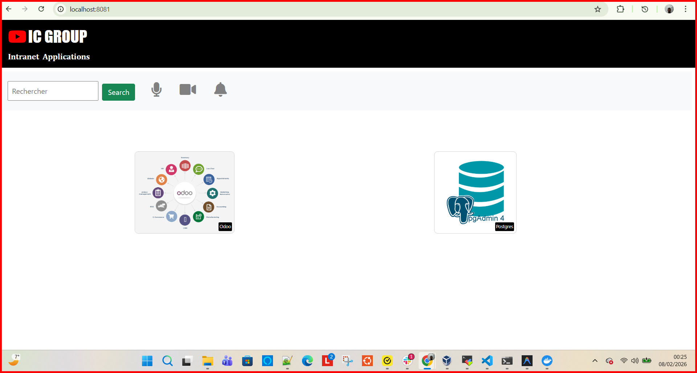
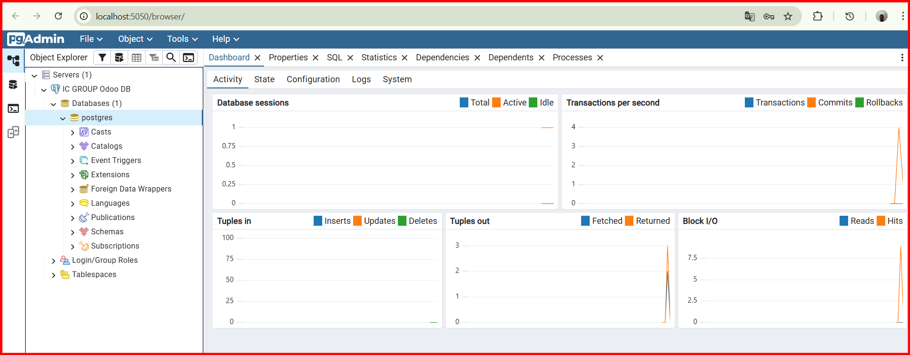
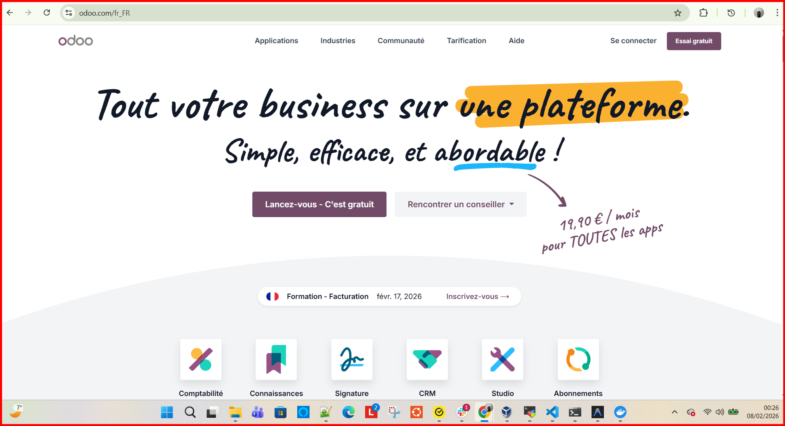
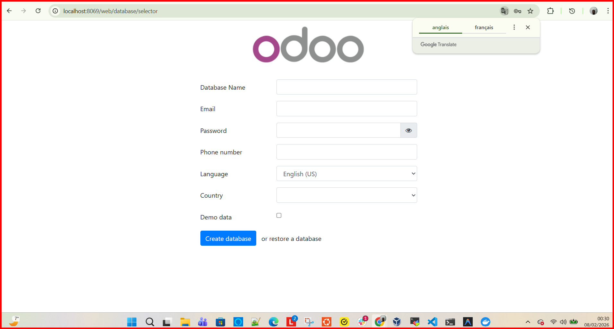
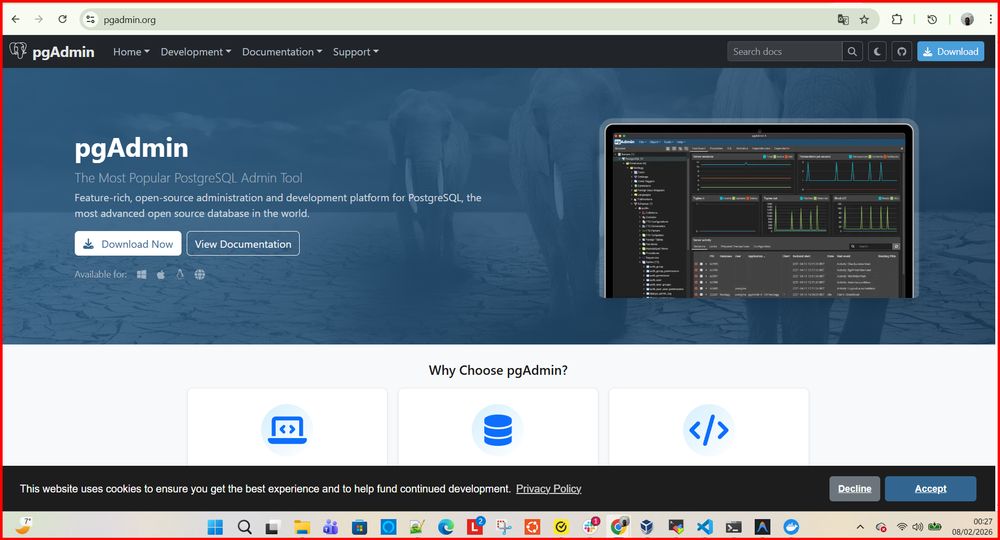

# RAPPORT FINAL - PROJET DEVOPS IC GROUP 🚀
# FINAL REPORT - IC GROUP DEVOPS PROJECT

## 1. INTRODUCTION
Ce projet consiste en la mise en place d'une infrastructure complète pour la société **IC GROUP**, incluant la conteneurisation d'une application vitrine Python/Flask, la création d'un pipeline CI/CD automatisé avec Jenkins et Ansible, et enfin le déploiement sur un cluster Kubernetes.
This project involves setting up a complete infrastructure for **IC GROUP**, including containerizing a Python/Flask showcase application, creating an automated CI/CD pipeline with Jenkins and Ansible, and finally deploying to a Kubernetes cluster.

---

## 2. PARTIE 1 : CONTENEURISATION (DOCKER)
## PART 1: CONTAINERIZATION (DOCKER)

L'application a été conteneurisée avec une image légère `python:3.6-alpine`.
The application was containerized using a lightweight `python:3.6-alpine` image.

### Procédure de déploiement / Deployment Procedure :
1. **Build de l'image** :
   ```bash
   docker build -t ic-webapp:1.0 .
   ```
2. **Test local** :
   ```bash
   docker run -d -p 8080:8080 --name test-ic-webapp -e ODOO_URL="https://www.odoo.com/" -e PGADMIN_URL="https://www.pgadmin.org/" ic-webapp:1.0
   ```

**Automatisation** : Un script `script.sh` a été intégré pour extraire dynamiquement les URLs du fichier `releases.txt` à l'aide de `awk`.
**Automation**: A `script.sh` script was integrated to dynamically extract URLs from the `releases.txt` file using `awk`.

---

## 3. PARTIE 2 : PIPELINE CI/CD (JENKINS & ANSIBLE)
## PART 2: CI/CD PIPELINE (JENKINS & ANSIBLE)

L'orchestration est gérée par un **Jenkinsfile** et le déploiement par des **rôles Ansible**.
Orchestration is managed by a **Jenkinsfile** and deployment by **Ansible roles**.

### Architecture du Pipeline / Pipeline Architecture :

- **Stage Checkout** : Récupération du code source.
- **Stage Build** : Build de l'image avec un tag dynamique (extrait de `releases.txt`).
- **Stage Push** : Envoi de l'image sur Docker Hub.
- **Stage Deploy** : Appel du playbook Ansible pour mettre à jour les serveurs de production.

### Rôles Ansible / Ansible Roles :
- `odoo_role` : Déploiement d'Odoo et PostgreSQL avec volume persistant.
- `pgadmin_role` : Déploiement de pgAdmin avec configuration automatique des serveurs.
- `webapp_role` : Déploiement de l'application vitrine.

---

## 4. PARTIE 3 : KUBERNETES (MINIKUBE)
## PART 3: KUBERNETES (MINIKUBE)

L'infrastructure a été portée sur Kubernetes dans le namespace `icgroup` avec le label `env=prod`.
The infrastructure has been ported to Kubernetes in the `icgroup` namespace with the label `env=prod`.

### Identification des ressources (A-H) / Resource Identification (A-H) :


| ID | Ressource | Type |
| :--- | :--- | :--- |
| **A** | ic-webapp-service | NodePort Service |
| **B** | ic-webapp | Deployment (2 Pods) |
| **C** | odoo-service | ClusterIP Service |
| **D** | odoo-web | Deployment (2 Pods) |
| **E** | odoo-db-service | ClusterIP Service |
| **F** | odoo-db | Deployment + PVC |
| **G** | pgadmin-service | ClusterIP Service |
| **H** | pgadmin | Deployment (1 Pod) |

### Commande de déploiement / Deployment Command :
```bash
kubectl apply -f kubernetes/
```

---

## 5. TESTS ET RÉSULTATS
## TESTS AND RESULTS

- **Validation Docker** : Les URLs sont correctement injectées dynamiquement via le script d'entrée.
- **Validation Kubernetes** : Vérification des pods avec `kubectl get pods -n icgroup`.
- **Accès Web** : L'interface est accessible via le NodePort (30080).

---

## 6. TROUBLESHOOTING (ERREURS ET SOLUTIONS)
## TROUBLESHOOTING (ERRORS AND SOLUTIONS)

| Problème / Problem | Solution |
| :--- | :--- |
| **Docker Desktop non démarré** | Démarrage manuel du service Docker avant le build. |
| **Connectivité Minikube** | Échec initial de connexion à `registry.k8s.io`, résolu par une attente de stabilisation du réseau. |
| **ImagePullBackOff (K8s)** | Image locale non trouvée dans Minikube. Solution : `minikube image load ic-webapp:2.0`. |
| **Accès IP Minikube (Windows)** | L'IP Minikube n'est pas routable directement sur Windows/Docker. Solution : utiliser `kubectl port-forward` pour mapper les ports sur `localhost`. |
| **Permissions script.sh** | Erreur de droit d'exécution résolue par `chmod +x` dans le Dockerfile. |

---

## 7. CONCLUSION
L'infrastructure est robuste, automatisée et sécurisée (utilisation de Kubernetes Secrets). Tous les objectifs d'**IC GROUP** ont été atteints.
The infrastructure is robust, automated, and secure (using Kubernetes Secrets). All **IC GROUP** objectives have been met.


## 7. SCREENSHOTS

### Site Vitrine & Application



### Odoo & Base de données




### Administration

